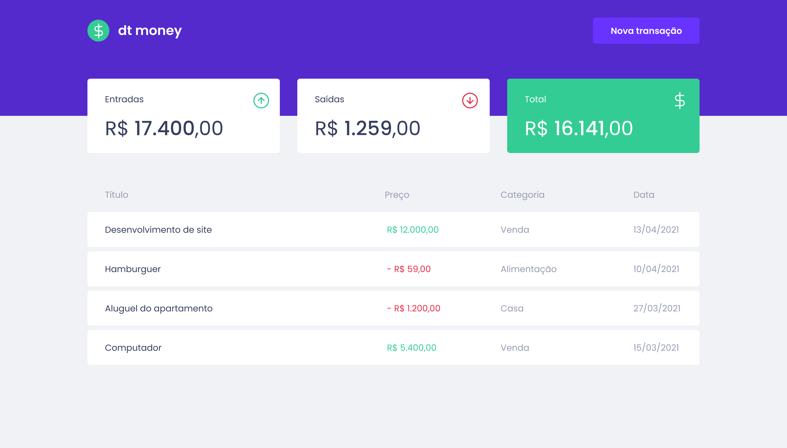

<h1 align="center">
    
</h1>

 

  

## Tecnologias
- [styled-components](https://styled-components.com/)
- [miragejs](https://miragejs.com/)
- [react-modal](https://github.com/reactjs/react-modal)
- [git-commit-msg-linter](https://github.com/legend80s/commit-msg-linter#readme)

## 💻 Projeto
Aplicativo para controle de finanças pessoais.

## 🚀 Como executar

- Clone o repositório
- Instale as dependências com `npm ci` ou `npm i`
- Inicie o servidor com `npm start`

Agora você pode acessar [`localhost:3000`](http://localhost:3000) do seu navegador.

